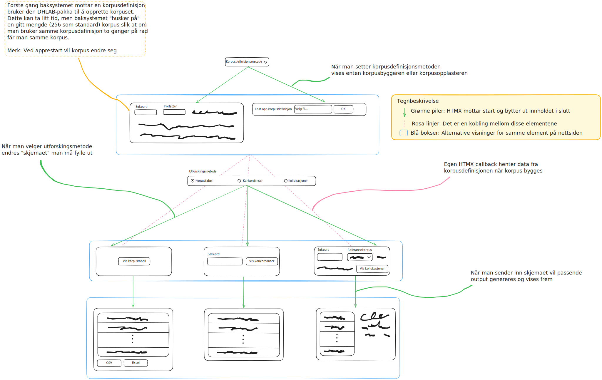

# DHLab korpusutforsker

Kjør appen lokalt for utvikling:

```
uv run python -m dhlab_corpus_webapp.app
```

## Overfladisk arkitektur

Korpusutforskeren er implementert som en [HTMX](https://htmx.org/)-applikasjon med et Flask baksystem.
På HTMX-siden har vi en nettside som består av fire skjema:

 * Korpusbyggermetode
 * Korpusbyggeren
 * Utforskingsmetode
 * Utforskingsinnstillinger

Måten applikasjonen fungerer på er at når korpusbyggemetode velges vil korpusbyggerskjemaet byttes ut.
Tilsvarende, når utforskingsmetoden byttes vil utforskingsinstillingerskjemaet byttes ut.
Videre, når en bruker trykker på <kbd>Hent korpustabell</kbd>/<kbd>Hent konkordanser</kbd>/<kbd>Hent kollokasjoner</kbd>-knappen vil både utforskingsinstillingene og korpusbyggeren sendes til baksystemet.
Baksystemet vil så bruke bruke korpusbyggeparametrene og DHLab-APIet (via `dhlab`-pakka) for å generere korpus og evt. konkordanser eller kollokasjoner.

## Visuell fremvisning av brukergrensesnittets logikk


[lenke til redigerbart bilde (lenke og bilde i teksten oppdateres ikke automatisk)](https://excalidraw.com/#json=xPQgTpVkqWBk7n293haXc,QfnD8uoXlABbUpC_2Qn3qg)

## Tabellvisninger

Korpusutforskeren bruker [`datatables.js`](https://datatables.net/) for å vise frem tabeller.
Alle tabeller opprettes med samme parametre, som settes i [`src/dhlab_corpus_webapp/static/js/tableinitializer.js`](../src/dhlab_corpus_webapp/static/js/tableinitializer.js)-filen.
Merk at for korpustabellen bruker vi Pandas for å generere tabellen, mens vi for konkordanser og kollokasjoner bruker et HTML-jinja-template.
Grunnen til det er at korpustabellen har vidt forskjellige kollonner avhengig av korpustype, mens konkordans- og kollokasjonstabellene er mer uniforme.
Derfor er det fint å bruke en mer eksplisitt måte å bygge disse tabellene.

Merk at korpustabellen har to visningsmoduser: enkel og detaljert.
For den enkle visningsmodusen er horisontal scrolling deaktivert, mens for den detaljerte er horisontal scrolling aktivert.
For å få til det er det en hendelseshåndterer som fanger opp når tabellvisningen endrer seg og regenererer hele tabellen.
Dette gjøres kun med JavaScript for å slippe unødvendige kall til baksystemet.
All logikk ligger også i [`src/dhlab_corpus_webapp/static/js/tableinitializer.js`](../src/dhlab_corpus_webapp/static/js/tableinitializer.js)-filen.
Merk at hvilke kolonner som vises frem i den enkle visningen spesifiseres av det originale `columnDefs`-objektet returnert av baksystemet (se `dhlab_corpus_webapp.app.get_corpus_column_definitions`).

## HTMX-hendelseshåndtering

Noen av tingene vi ønsket å gjøre med HTMX var ikke innebygd i HTMX.
Vi har derfor utvidet HTMX sin oppførsel ved hjelp av noen hendelseshåndterere (event handlers).
Disse ligger i [`src/dhlab_corpus_webapp/static/js/htmx_events.js`](../src/dhlab_corpus_webapp/static/js/htmx_events.js) og ved skrivende stund har vi tre slike hendelseshåndterere:

1. En som lytter til når HTMX-kall sendes til baksystemet, hvis det triggende kallet var utforskingsinnstillinger-skjemaet vil korpusbyggerskjemaet også legges ved HTTP-spørringen.
2. En som lytter til når HTMX-kall sendes til baksystemet, hvis det triggende kallet var utforskingsmetode-skjemaet vil korpusvisningen nullstilles (f.eks. vil korpustabellen forsvinne når man skifter til konkordanser eller kollokasjoner)
3. En som lytter til når HTMX er ferdig med å "flette inn" ny HTML i DOM-en, hvis det var korpusvisningen (HTML-tagen med output-id) som ble oppdatert scroller nettsiden automatisk til den.

## Korpusbygger

Det er noe logikk rundt korpusbyggeren.
For det første vil i teorien alle kall generere et nytt korpus.
Dette er dog veldig tregt, og derfor har vi caching av korpus i baksystemet.
Det nøyaktig antallet korpus som caches spesifiseres av `DHLAB_CORPUS_CACHE_SIZE`-miljøvariabelen, men er som standard satt til 64.

Det er også slik at ulike dokumenttyper har ulike felt vi kan bruke for å søke.
For å gjøre det lett for brukere å vite hva som har en effekt vil irrelevante deler av skjemaet deaktiveres når man bytter dokumenttype.
Dette er implementert ved at korpusbygger-HTMLen (den som HTMX fletter inn når man velger korpusbyggemetode) legger på en hendelseshåndterer som blir aktivert hver gang noen endrer dokumenttype.
Logikken for hvilke felt som er aktive når er implementert i [`src/dhlab_corpus_webapp/static/js/disable_enable_fields.js`](../src/dhlab_corpus_webapp/static/js/disable_enable_fields.js).

Korpusbyggeren inneholder også en flervalgsnedtrekksmeny. Koden for denne er hentet fra et MIT-lisensiert [åpenkildekodeprosjekt på GitHub](https://github.com/codeshackio/multi-select-dropdown-js).
Pass på å ikke slett lisensteksten fra de korresponderende filene.
Fordelen med denne implementasjonen er at den har støtte for tastaturnavigering på nettsiden *og* at den baserer seg på det innebygde multiselect HTML-elementet, så om noen svartelister `multiselect.js`-scriptet vil skjemaet fremdeles virke.
Merk at vi har gjort en liten endring i koden for flervalgsnedtrekksmenyen. I originalkoden ble skjulte skjemaelement med navn `{originalnavn}[]` lagt til, men vi har endret det slik at navnet bare blir `{originalnavn}`.
Spesifikt er linjene

```javascript
${this.selectedValues.map(value => `<input type="hidden" name="${this.name}[]" value="${value}">`).join('')}
[...]
this.element.insertAdjacentHTML('afterbegin', `<input type="hidden" name="${this.name}[]" value="${option.dataset.value}">`);
```

erstattet med

```javascript
${this.selectedValues.map(value => `<input type="hidden" name="${this.name}" value="${value}">`).join('')}
[...]
this.element.insertAdjacentHTML('afterbegin', `<input type="hidden" name="${this.name}" value="${option.dataset.value}">`);
```


## Baksystem

Flask-logikken i baksystemet ligger i [`src/dhlab_corpus_webapp/app.py`](../src/dhlab_corpus_webapp/app.py).
Filen inneholder hovedsakelig logikk for svare på spørringer.
All cachelogikk og dataeksportering (for nedlasting av zip-filer) ligger i henholdsvis [`src/dhlab_corpus_webapp/corpus.py`](../src/dhlab_corpus_webapp/corpus.py) og [`src/dhlab_corpus_webapp/export.py`](../src/dhlab_corpus_webapp/export.py).

Dette gjør at [`src/dhlab_corpus_webapp/app.py`](../src/dhlab_corpus_webapp/app.py) ikke er en alt for stor fil, kun ca 300 linjer hvor 100 av dem er konfigurasjon.
Hovedlogikken i filen ligger i `render_corpus_table_for_request`, `render_concordances_for_request` og `render_collocations_for_request`, som tar et `Flask.Request`-objekt som input og som returnerer HTML-en som skal returneres til HTMX.

I tillegg har vi en rekke hjelpefunksjoner som `render_*`-funksjonene bruker og `create_app`-funksjonen som generer ett tynt Flask objekt.
Logikken til hver av endepunkt-håndteringfunksjonene er hovedsakelig enkel datavalidering og valg av hvilke maler (templates) som skal brukes for responsen.
